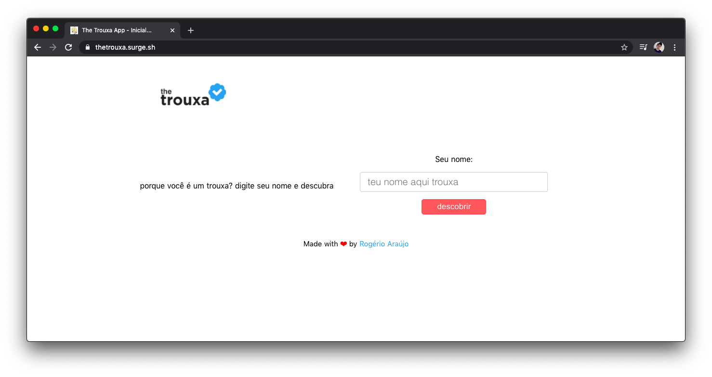

<div align="center">
  <h1>the trouxa app</h1>
  <p><blockquote align="center">...find out why you are a <strong>trouxa</strong>!</blockquote></p>  
		<sub>Made with ❤︎ by
    <a href="https://github.com/rodgeraraujo">Rogério Araújo</a>
  </sub>
</div>

## The Trouxa App

Simple app developed using Nuxt.js and Firebase, as a way of learning and having fun. The app is a simple tool, which "finds out" why you are a "[trouxa](https://www.dicionarioinformal.com.br/trouxa/)" based on random information.

## Demo 🚀 [](https://thetrouxa.surge.sh/)

[thetrouxa.surge.sh](https://thetrouxa.surge.sh/)

## Installation and Build Setup

```bash
# clone the repository
$ git clone https://github.com/rodgeraraujo/the-trouxa

# enter into repositoru
$ cd the-trouxa

# install dependencies
$ yarn install

# serve with hot reload at localhost:3000
$ yarn dev

# build for production and launch server
$ yarn build
$ yarn start

# generate static project
$ yarn generate
```

## Screenshot ✨

<figure>
  
  <!-- -->
  <figcaption>Desktop version of the app.</figcaption>
</figure>

## Contributing 🍰 [](https://github.com/rodgeraraujo/the-trouxa)

If you want to contribute to a project and make it better, feel free to fork and contribute.

## Author 👽

[Rogério Araújo](https://github.com/rodgeraraujo) :octocat:
